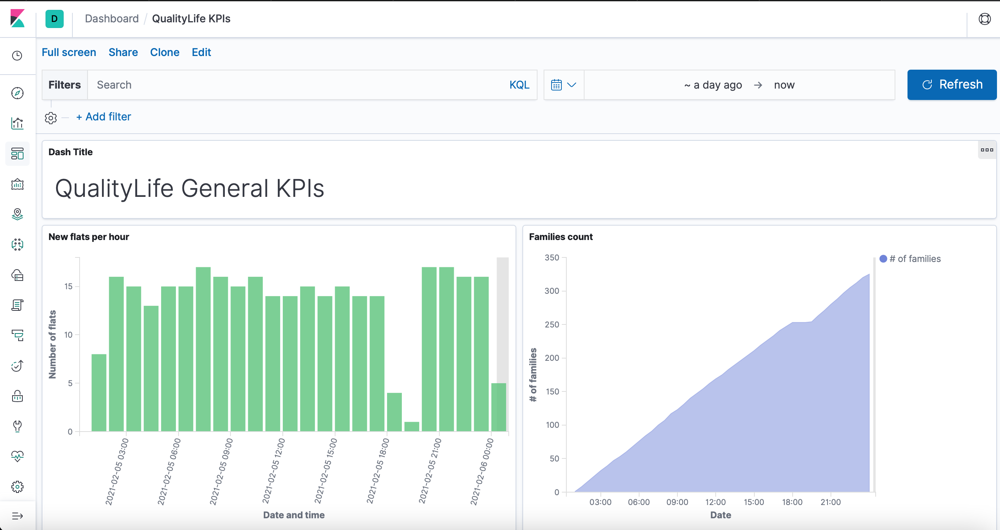

# Data Project 2 - Master Data Analytics EDEM

## Equipo

* [Sofía Zander](https://github.com/sozanmen)
* [Vicente Gil](https://github.com/vicentegilso)
* [Jorge Camáñez](https://github.com/jcamcre)
* [Javier Briones](https://github.com/jabrio)
* [Vicent Asensio](https://github.com/viasmo1)

## Program setup

### Create a VM instance in GCP

1. Enter your [google cloud console](https://console.cloud.google.com)
2. Click on CREATE INSTANCE and set up the VM instance with the following configuration:

    * Name: *instance_name*
    * Region and zone: *select the closest one*
    * Machine type: *e2-medium*
    * Boot disk: 
        * OS: *Container Optimized OS*
        * Size: *50GB*
    * Firewall: *Allow HTTP and HTTPS*
    * Networking: *Add network tag* **docker-ports**
    
3. Click on CREATE FIREWALL RULE and set up the new rule with the following configuration:

    * Name: *rule_name*
    * Direction of traffic: *Ingress*
    * Targets: *Specified target tags*
    * Target tags: **docker-ports**
    * Source filters: *IP ranges*
    * Source Ip ranges: **0.0.0.0/0**
    * Protocols and ports: *Specified protocols and ports* -> *tcp* -> *8090, 5601, 8888, 9200, 9092, 2181*

4. Navigate to COMPUTE -> Compute Engine -> VM Instances and click on **SSH** to enter you VM console and run the following comands 

```sh
docker run docker/compose:1.27.4
```
```sh
echo alias docker-compose="'"'docker run \
    -v /var/run/docker.sock:/var/run/docker.sock \
    -v "$PWD:$PWD" \
    -w="$PWD" \
    docker/compose:1.27.4'"'" >> ~/.bashrc

source ~/.bashrc
```

### Clone the repo and run containers

* Git clone the following repo: [edem-mda-DP2-wake](https://github.com/viasmo1/edem-mda-DP2-wake)

```sh
git clone https://github.com/viasmo1/edem-mda-DP2-wake
```

* Go to the repo's folder

```sh
 cd edem-mda-DP2-wake
```

* Run the docker-compose

```sh
docker-compose up -d
```

**Components**

| Component | Port |
| --- | --- |
| Nifi | 8090 | 
| Jupyter Notebook | 8888 |
| Kafka-Broker | 9092 |
| Kakfa-Zookeeper| 2181 |
| Elasticsearch | 9200 |
| Kibana | 5601 |


### Dealing with the data in Elasticsearch

* Go to ***instance_url*:5601**

* Create the index *families*, *flats* and *match* and map the *timestamp_ms* property with a date data type:

    ```sh
    {
        "mappings": {
            "properties": {
                "timestamp_ms": {
                    "type": "date" 
                }
            }
        }
    }
    ```


### Access nifi notebook and run the template

* Go to ***instance_url*:8090/nifi**

* Upload the template *WakeTeam_DataProject2_NifiTemplate.xml* available in the Nifi folder

* Enter your twitter API credentials in the GetTwitter processor

* Run the workflow

### Access jupyter notebook and run the file

* Go to ***instance_url*:8888**

* Upload the file *DP2-WakeTeam.ipynb*

* Enter your twitter API credentials in the *Twitter authentication cell*

* Run all cells

### Access Kibana and create the indices

* Access ***instance_url*:5601**

* Go to Index Pattern and create one patern for *families* and another one for *flats*. Don't forget to select *timestamp_ms* as date filter.

## VIDEO

[App Wake](https://www.youtube.com/watch?v=bQes1Oz1c6s)

## CONGRATULATIONS

You're all set! Your clients will start receiving your tweet replies!
You will alse visualise and control your application using Kibana!


